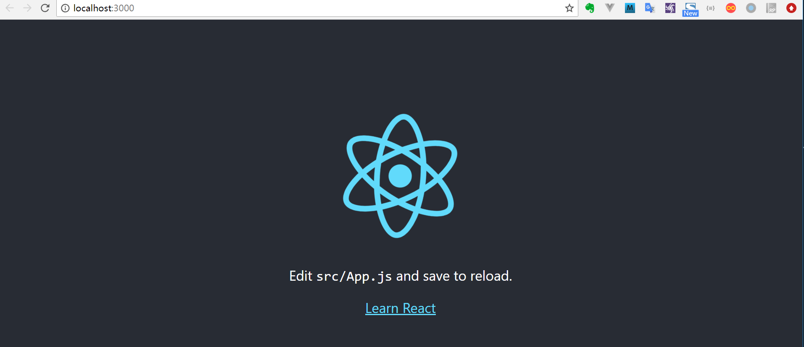

# 搭建React项目

使用create-react-app快速构建React开发环境。<br>
create-react-app 是来自于 Facebook，通过该命令我们无需配置就能快速构建 React 开发环境。<br>
create-react-app 自动创建的项目是基于 Webpack + ES6。<br>

执行以下命令创建项目：(有可能会报错 Unexpected end of JSON input while parsing near '....0","dependencies":{"' ，假如报错，需要执行`npm cache clean --force`)

```javascript
cnpm install -g create-react-app
create-react-app imooc-react-app
cd imooc-react-app/
npm start
```
在浏览器中打开 http://localhost:3000/ ，结果如下图所示：



此时在packge.json文件基本什么都没有，所有的配置都集成在了"react-scripts"，如果想更改配置,执行以下命令会把所有的配置全部提取出来。
```
npm run eject
```

