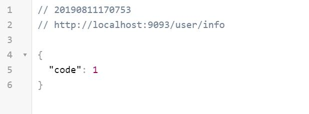
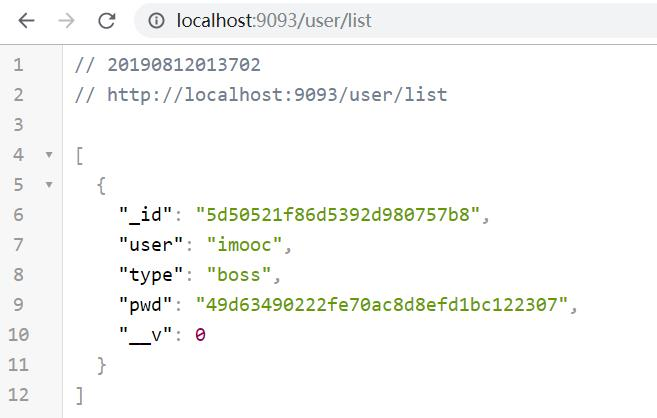
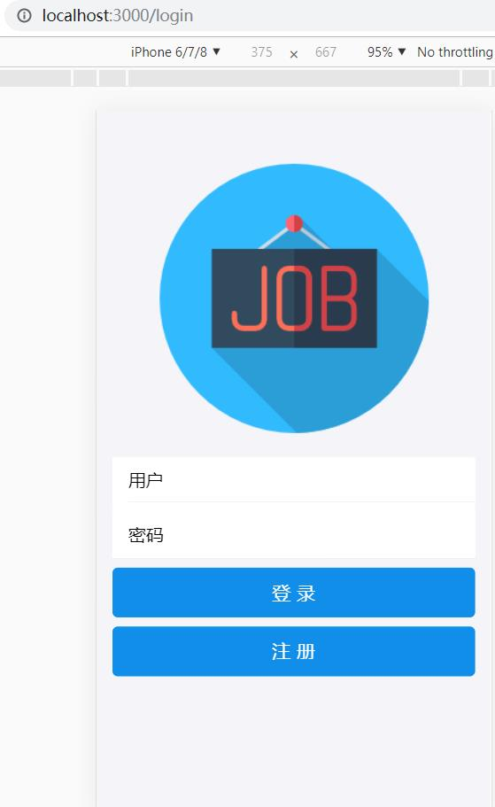
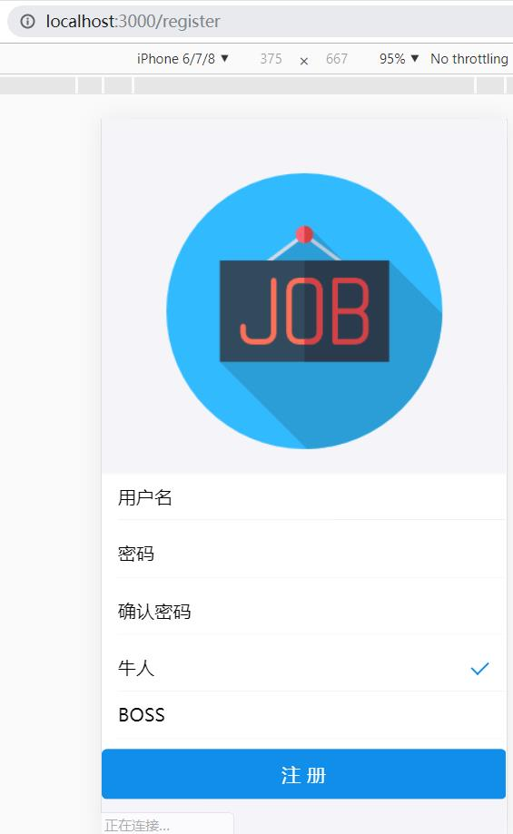

# 登录注册

将04_express+axios项目为基础(已添加redux/router/express/axios/antd-mobile等)进行开发：[04_express+axios](https://github.com/ccyinghua/React/tree/master/04_express%2Baxios)

首先将之前项目多余的页面文件去掉，变成一个空项目。src下保留config.js/index.js/reducer.js，在src下建立component(组件)/container(页面性文件)/redux文件夹。

空项目放于demo分支下载： [https://github.com/ccyinghua/imooc-react-chat/tree/demo](https://github.com/ccyinghua/imooc-react-chat/tree/demo)


首先项目基于cookie用户验证：
- express依赖cookie-parser ，需要npm install cookie-parser –save安装
- cookie类似于一张身份卡，登录后服务器端返回，你带着cookie就可以访问受限资源
- 页cookie的管理浏览器会自动处理

下载cookie-parser
```javascript
cnpm install cookie-parser --save
```
# 目录
- [**一、登录与注册基础页面**](#一、登录与注册基础页面)
- [**二、用户信息校验，跳转判断**](#二、用户信息校验，跳转判断)
- [**三、注册登录交互实现**](#三、注册登录交互实现)
    - [3.1注册登录后端](#3.1注册登录后端)
    - [3.2前端交互](#3.2前端交互)

### <a id="一、登录与注册基础页面"></a>一、登录与注册基础页面

logo组件：
[src/component/logo](https://github.com/ccyinghua/imooc-react-chat/blob/master/src/component/logo/index.js)

登录页：src/container/login
```javascript
import React from "React";
import Logo from "../../component/logo";
import { List, InputItem, WingBlank, WhiteSpace, Button } from "antd-mobile";

class Login extends React.Component {
	constructor(props) {
		super(props);

		this.state = {
			user: "",
			pwd: ""
		};

		// 方法绑定this
		this.register = this.register.bind(this);
		this.handleLogin = this.handleLogin.bind(this);
	}

	handleChange(key, val) {
		// state发生变化，组件进入重新渲染的流程
		this.setState({
			[key]: val
		});
	}
	register() {
		this.props.history.push("/register"); // 跳转至注册页面
	}
	handleLogin() {}

	render() {
		return (
			<div>
				<Logo></Logo>
				<WingBlank>
					<List>
						<InputItem onChange={v => this.handleChange("user", v)}>用户</InputItem>
						<WhiteSpace />
						<InputItem onChange={v => this.handleChange("pwd", v)}>密码</InputItem>
					</List>
					<WhiteSpace />
					<Button onClick={this.handleLogin} type="primary">
						登录
					</Button>
					<WhiteSpace />
					<Button onClick={this.register} type="primary">
						注册
					</Button>
				</WingBlank>
			</div>
		);
	}
}

export default Login;
```
注册页：src/container/register
```javascript
import React from "React";
import Logo from "../../component/logo";
import { List, InputItem, Radio, WingBlank, WhiteSpace, Button } from "antd-mobile";

class Rehister extends React.Component {
	constructor(props) {
		super(props);

		this.state = {
			user: "",
			pwd: "",
			repeatpwd: "",
			type: "genius" // 或者boss
		};

		this.handleRegister = this.handleRegister.bind(this);
	}

	handleChange(key, val) {
		// state发生变化，组件进入重新渲染的流程
		this.setState({
			[key]: val
		});
	}
	handleRegister() {}

	render() {
		const RadioItem = Radio.RadioItem;
		return (
			<div>
				<Logo></Logo>
				<List>
					<InputItem onChange={v => this.handleChange("user", v)}>用户名</InputItem>
					<WhiteSpace />
					<InputItem type="password" onChange={v => this.handleChange("pwd", v)}>
						密码
					</InputItem>
					<WhiteSpace />
					<InputItem type="password" onChange={v => this.handleChange("repeatpwd", v)}>
						确认密码
					</InputItem>
					<WhiteSpace />
					<RadioItem checked={this.state.type == "genius"} onChange={() => this.handleChange("type", "genius")}>
						牛人
					</RadioItem>
					<RadioItem checked={this.state.type == "boss"} onChange={() => this.handleChange("type", "boss")}>
						BOSS
					</RadioItem>
					<WhiteSpace />
					<Button type="primary" onClick={this.handleRegister}>
						注册{" "}
					</Button>
				</List>
			</div>
		);
	}
}

export default Rehister;
```
src/index.js
```javascript
import Login from "./container/login";
import Register from "./container/register";

......

// 将store等传递给App组件
ReactDOM.render(
	<Provider store={store}>
		<BrowserRouter>
			<div>
				<Route path="/login" component={Login} />
				<Route path="/register" component={Register} />
			</div>
		</BrowserRouter>
	</Provider>,
	document.getElementById("root")
);
```

### <a id="二、用户信息校验，跳转判断"></a>二、用户信息校验，跳转判断

1、用户信息接口 <br>
server/user.js
```javascript
const express = require("express");
const Router = express.Router();

Router.get("/info", function(req, res) {
	return res.json({ code: 1 });
});

module.exports = Router;
```
server/server.js
```javascript
const express = require("express");
const userRouter = require("./user");
// 新建app
const app = express();

app.use("/user", userRouter);

app.listen(9093, function() {
	console.log("Node app start at port 9093");
});
```
执行命令：
```
cd server
nodemon server.js
```
浏览器地址: http://localhost:9093/user/info



2、判断跳转组件：[src/component/authroute](https://github.com/ccyinghua/imooc-react-chat/blob/master/src/component/authroute/index.js)

authroute组件中获取用户信息，获取不到用户信息跳转到login登录页面，authroute组件不是路由组件，无法跳转路由，使用`react-router-dom`的`withRouter`.就可以使用`this.props.history`;
```javascript
import React from "react";
import axios from "axios";
import { withRouter } from "react-router-dom";

// 该路由是非路由组件，withRouter 解决this.props.history跳转问题
@withRouter
class Authroute extends React.Component {
	componentDidMount() {
		// 获取用户信息
		axios.get("user/info").then(res => {
			if (res.status === 200) {
				if (res.data.code == 0) {
					// 有登录信息
				} else {
					this.props.history.push("/login");
				}
			}
		});
	}

	render() {
		return null;
	}
}

export default Authroute;
```
### <a id="三、注册登录交互实现"></a>三、注册登录交互实现

#### <a id="3.1注册登录后端"></a>3.1注册登录后端

`body-parser` 解析post请求传过来的json;`cookie-parser`解析cookie;
```javascript
// 下载body-parser
cnpm install body-parser --save
```
[server/server.js](https://github.com/ccyinghua/imooc-react-chat/blob/master/server/server.js) express启动文件;
[server/model.js](https://github.com/ccyinghua/imooc-react-chat/blob/master/server/model.js) 链接mongoose,建立数据库模型;
[server/user.js]((https://github.com/ccyinghua/imooc-react-chat/blob/master/server/user.js)) 用户接口文件;

#### <a id="3.2前端交互"></a>3.2前端交互
[src/redux/user.redux.js](https://github.com/ccyinghua/imooc-react-chat/blob/master/src/redux/user.redux.js)

src/reducer,js
```javascript
// 合并所有reducer 并且返回
import { combineReducers } from "redux";
import { user } from "./redux/user.redux";

export default combineReducers({ user });
```
src/container/login/index.js
```javascript
import { connect } from "react-redux";
import { login } from "../../redux/user.redux";

@connect(
	state => state.user,
	{ login }
)
......
// 登录
handleLogin() {
    this.props.login(this.state);
}
```

src/container/register/index.js
```javascript
import { connect } from "react-redux";
import { login } from "../../redux/user.redux";

// 装饰器模式
@connect(
	state => state.user,
	{ login }
)

handleLogin() {
	this.props.login(this.state);
}
```

src/component/authroute
```javascript
import { loadData } from "../../redux/user.redux";
import { connect } from "./node_modules/react-redux";

@connect(
	null,
	{ loadData }
)

// 获取用户信息
axios.get("user/info").then(res => {
	if (res.status === 200) {
		if (res.data.code === 0) {
			// 有登录信息
			this.props.loadData(res.data.data);
		} else {
			this.props.history.push("/login");
		}
	}
});
```
注册页面注册账户，成功之后浏览器输入 [http://localhost:9093/user/list](http://localhost:9093/user/list) 验证查看注册账户是否成功。






加加加


