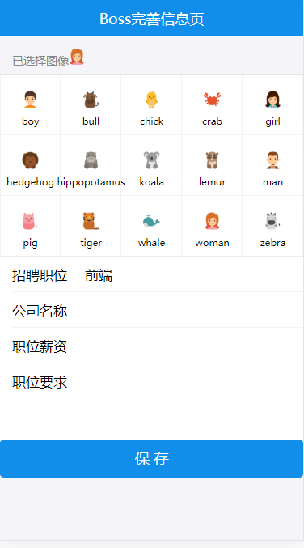
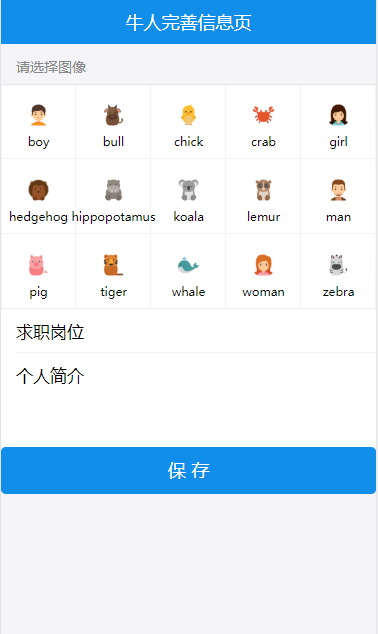

# 完善用户信息

# 目录
- [**一、boss完善信息**](#一、boss完善信息)
- [**二、牛人完善信息**](#二、牛人完善信息)
- [**三、组件属性类型检测PropTypes**](#三、组件属性类型检测PropTypes)


### <a id="一、boss完善信息"></a>一、boss完善信息
添加信息保存接口：[server/user.js](https://github.com/ccyinghua/imooc-react-chat/blob/master/server/user.js)
<br/>
引入bossinfo组件页面：[src/index.js](https://github.com/ccyinghua/imooc-react-chat/blob/master/src/index.js)
<br/>
<br/>
头像子组件：[src/component/avatar-selector](https://github.com/ccyinghua/imooc-react-chat/blob/master/src/component/avatar-selector/index.js)
<br/>
boss完善信息页面：[src/container/bossinfo](https://github.com/ccyinghua/imooc-react-chat/blob/master/src/container/bossinfo/index.js)


### <a id="二、牛人完善信息"></a>二、牛人完善信息
引入geniusinfo组件页面：[src/index.js](https://github.com/ccyinghua/imooc-react-chat/blob/master/src/index.js)
<br/>
牛人完善信息页面：[src/container/geniusinfo](https://github.com/ccyinghua/imooc-react-chat/blob/master/src/container/geniusinfo/index.js)


### <a id="三、组件属性类型检测PropTypes"></a>三、组件属性类型检测PropTypes
[https://react.docschina.org/docs/typechecking-with-proptypes.html](https://react.docschina.org/docs/typechecking-with-proptypes.html)
<br/>
安装prop-types
```
cnpm install prop-types --save
```

src/component/avatar-selector/index.js
```javascript
import PropTypes from "prop-types";
class AvatarSelector extends React.Component {
	static propTypes = {
		selectAvatar: PropTypes.func.isRequired // selectAvatar是一个function,且必传
	};
}
```

http://localhost:3000/bossinfo<br/>

<br/>
http://localhost:3000/geniusinfo<br/>


