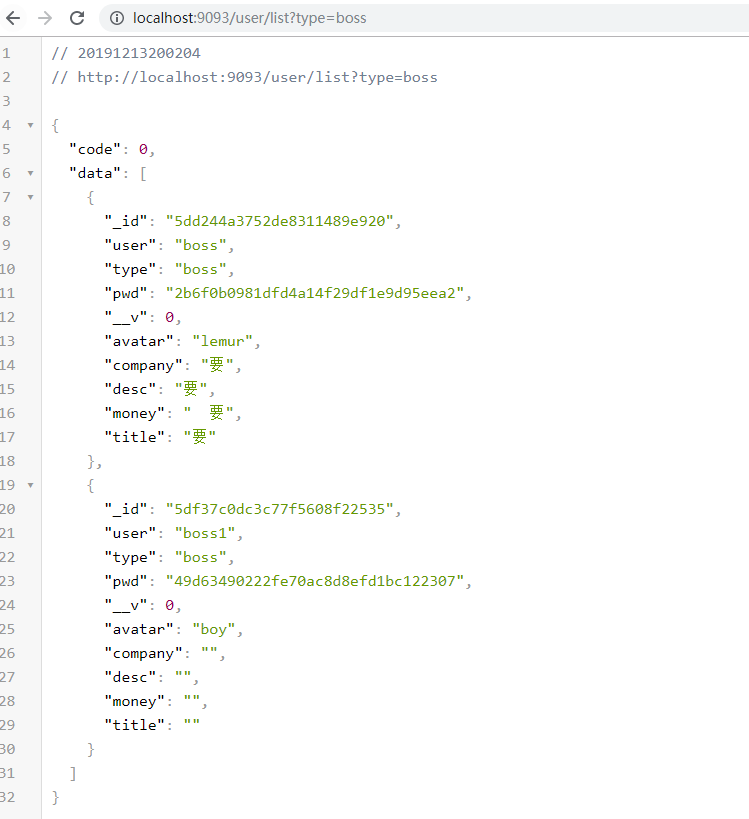
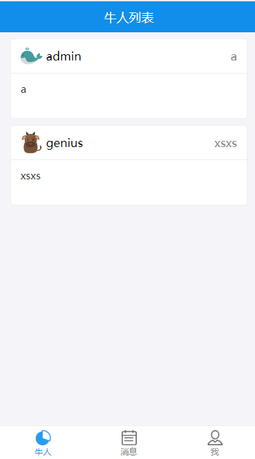
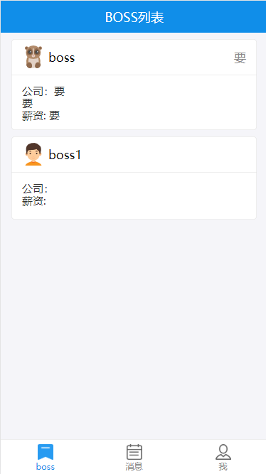

# Boss与牛人列表页面

# 目录
- [**一、boss完善信息**](#一、boss完善信息)
- [**二、牛人完善信息**](#二、牛人完善信息)
	- [2.1列表接口](#2.1列表接口)
	- [2.2列表请求](#2.2列表请求)
	- [2.3redux管理列表数据](#2.3redux管理列表数据)
- [**三、genius牛人列表**](#三、genius牛人列表)

### <a id="一、列表页"></a>一、列表页
引入列表页面：[src/index.js](https://github.com/ccyinghua/imooc-react-chat/blob/master/src/index.js)

```javascript
import Dashboard from "./component/dashboard";
	...
<Route component={Dashboard} />
```
列表组件：[src/component/dashboard](https://github.com/ccyinghua/imooc-react-chat/blob/master/src/component/dashboard/index.js)

底部菜单navLink子组件：[src/component/navLink](https://github.com/ccyinghua/imooc-react-chat/blob/master/src/component/navLink/index.js)

boss列表路由组件：[src/component/boss](https://github.com/ccyinghua/imooc-react-chat/blob/master/src/component/boss/index.js)

genius牛人列表路由组件：[src/component/genius](https://github.com/ccyinghua/imooc-react-chat/blob/master/src/component/genius/index.js)


### <a id="二、boss列表"></a>二、boss列表

- ### <a id="2.1列表接口"></a>2.1列表接口
列表接口：[server/user.js](https://github.com/ccyinghua/imooc-react-chat/blob/master/src/server/user.js)
```javascript
Router.get("/list", function(req, res) {
	const { type } = req.query;
	// User.remove({},function(e,d){})
	User.find({ type }, function(err, doc) {
		return res.json({ code: 0, data: doc });
	});
});
```
查看数据：http://localhost:9093/user/list?type=boss / http://localhost:9093/user/list?type=boss



- ### <a id="2.2列表请求"></a>2.2列表请求
src/component/boss
```javascript
import React from "react";
import axios from "axios";
import UserCard from "../usercard";

class Boss extends React.Component{
    constructor(props) {
        super(props);
        this.state = {
            data: []
        };
    };

    componentDidMount() {
        axios.get("/user/list?type=boss").then(res => {
            if (res.data.code === 0) {
                this.setState({data: res.data.data});
            }
        });
    }

    render() {
        console.log(this.state.data);
        return (
            <div>
                <UserCard userlist={this.state.data}></UserCard>
            </div>
        );
    }
}

export default Boss;
```
boss列表子组件[src/component/usercard](https://github.com/ccyinghua/imooc-react-chat/blob/master/src/component/usercard/index.js)

```javascript
import React from "react";
import PropTypes from "prop-types";
import { Card, WhiteSpace, WingBlank } from "antd-mobile";

class UserCard extends React.Component {
	static propTypes = {
		userlist: PropTypes.array.isRequired
	};

	render() {
		return (
			<WingBlank>
				{this.props.userlist.map(v => {
					return v.avatar ? (
						<div>
							<WhiteSpace></WhiteSpace>
							<Card>
								<Card.Header title={v.user} thumb={require(`../assets/img/${v.avatar}.png`)} extra={<span>{v.title}</span>} />
								<Card.Body>
									{v.type === "boss" ? <div>公司：{v.company}</div> : null}
									{v.desc.split("\n").map(d => (
										<div key={d}>{d}</div>
									))}
									{v.type === "boss" ? <div>薪资:{v.money}</div> : null}
								</Card.Body>
							</Card>
						</div>
					) : null;
				})}
			</WingBlank>
		);
	}
}

export default UserCard;
```
http://localhost:3000/boss<br />


- ### <a id="2.3redux管理列表数据"></a>2.3redux管理列表数据
[redux/chatuser.redux.js](https://github.com/ccyinghua/imooc-react-chat/blob/master/src/redux/chatuser.redux.js)

src/reducer.js
```javascript
// 合并所有reducer 并且返回
import { combineReducers } from "redux";
import { user } from "./redux/user.redux";
import { chatuser } from "./redux/chatuser.redux";

export default combineReducers({ user, chatuser });
```
src/component/boss
```javascript
import React from "react";
import { connect } from "react-redux";
import { getUserList } from '../../redux/chatuser.redux';
import UserCard from "../usercard";

@connect(
    state => state.chatuser,
    { getUserList }
)
class Boss extends React.Component{
    componentDidMount() {
        this.props.getUserList("genius");
    }

    render() {
        return (
            <div>
                <UserCard userlist={this.props.userlist}></UserCard>
            </div>
        );
    }
}

export default Boss;
```

### <a id="三、genius牛人列表"></a>三、genius牛人列表
[src/component/genius](https://github.com/ccyinghua/imooc-react-chat/blob/master/src/component/genius/index.js)
```javascript
import React from "react";
import {connect} from "react-redux";
import {getUserList} from "../../redux/chatuser.redux";
import UserCard from "../usercard";

@connect(
	state=>state.chatuser,
	{getUserList}
)
class Genius extends React.Component{
	componentDidMount() {
		this.props.getUserList("boss")
	}
	render(){
		return <UserCard userlist={this.props.userlist}></UserCard>
	}
}
export default Genius
```
http://localhost:3000/genius<br/>


