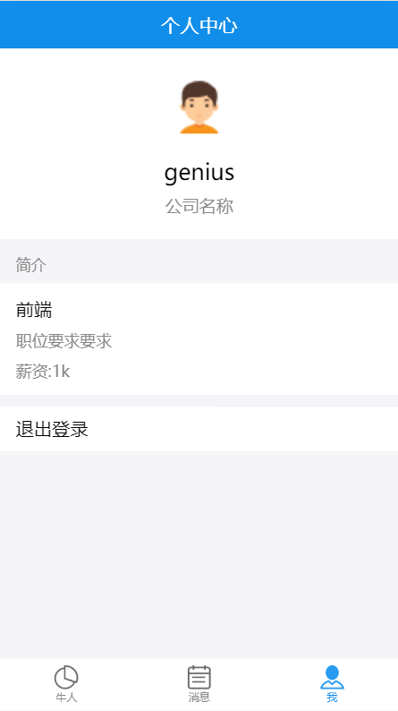
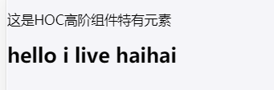
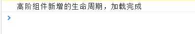

# 个人中心

# 目录
- [**一、个人中心**](#一、个人中心)
- [**二、高阶组件**](#二、高阶组件)

### <a id="一、个人中心"></a>一、个人中心

列表组件：[src/component/dashboard](https://github.com/ccyinghua/imooc-react-chat/blob/master/src/component/dashboard/index.js)&nbsp;&nbsp;引入个人中心user路由组件

user个人中心路由组件：[src/component/user](https://github.com/ccyinghua/imooc-react-chat/blob/master/src/component/user/index.js)

登出时需清除cookies;并清除redux数据
```javascript
// 安装cookies
cnpm install browser-cookies --save
```
登出清除redux：[src/redux/user.redux.js](https://github.com/ccyinghua/imooc-react-chat/blob/master/src/redux/user.redux.js)

http://localhost:3000/me


### <a id="二、高阶组件"></a>二、高阶组件

```javascript
function hello() {
	console.log("hello you live");
}

function WrapperHello(fn) {
	return function() {
		console.log("before hello");
		fn();
		console.log("after hello");
	};
}

hello = WrapperHello(hello);
hello();

// console返回:
// before hello
// hello you live
// after hello
```
函数可以当参数，也可以当返回值。以下hello被包裹装饰了一层，这种模式叫装饰器模式。<br>
React高阶组件HOC就是这种模式，把一个组件传入，返回另外一个组件。<br>
`React高阶组件分为属性代理与反向继承：属性代理给组件包裹一层；反向继承可以修改组件的生命周期等。`

- React高阶组件属性代理
```javascript
class Hello extends React.Component {
	render() {
		return <h2>hello i live haihai</h2>;
	}
}

// 属性代理
function WrapperHello(Comp) {
	class WrapComp extends React.Component {
		render() {
			return (
				<div>
					<p>这是HOC高阶组件特有元素</p>
					<Comp {...this.props}></Comp>
				</div>
			);
		}
	}
	return WrapComp;
}

// 去除这一行就只会展示Hello组件内容“hello i live haihai”
Hello = WrapperHello(Hello);

// Login页面
class Login extends React.Component {
	render() {
		return (
			<div>
				<Hello></Hello>	
			</div>
		)
	}
}
export default Login;
```
- React高阶组件便捷写法`@`符号
```javascript
// 属性代理
function WrapperHello(Comp) {
	class WrapComp extends React.Component {
		render() {
			return (
				<div>
					<p>这是HOC高阶组件特有元素</p>
					<Comp {...this.props}></Comp>
				</div>
			);
		}
	}
	return WrapComp;
}

// 装饰器模式
@WrapperHello
class Hello extends React.Component {
	render() {
		return <h2>hello i live haihai</h2>;
	}
}

// Login页面
class Login extends React.Component {
	render() {
		return (
			<div>
				<Hello></Hello>	
			</div>
		)
	}
}
export default Login;
```


- React高阶组件反向继承
```javascript
// 反向继承
function WrapperHello(Comp) {
	class WrapComp extends Comp {
		componentDidMount() {
			console.log("高阶组件新增的生命周期，加载完成");
		}
		render() {
			return <Comp></Comp>;
		}
	}
	return WrapComp;
}

// 装饰器模式
@WrapperHello
class Hello extends React.Component {
	render() {
		return <h2>hello i live haihai</h2>;
	}
}

// Login页面
class Login extends React.Component {
	render() {
		return (
			<div>
				<Hello></Hello>	
			</div>
		)
	}
}
export default Login;
```


- 公共setState方法简易高阶组件

公共setState方法简易高阶组件：[src/component/imooc-form](https://github.com/ccyinghua/imooc-react-chat/blob/master/src/component/imooc-form/index.js)

[src/container/login](https://github.com/ccyinghua/imooc-react-chat/blob/master/src/container/login/index.js)

```javascript
import React from "React";
import Logo from "../../component/logo";
import { List, InputItem, WingBlank, WhiteSpace, Button } from "antd-mobile";
import { Redirect } from "react-router-dom";
import { connect } from "react-redux";
import { login } from "../../redux/user.redux";
import imoocForm from "../../component/imooc-form";

// imoocForm提供state数据,handleChange方法
@connect(state => state.user, { login })
@imoocForm
class Login extends React.Component {
	constructor(props) {
		super(props);

		// this.state = {
		// 	user: "",
		// 	pwd: ""
		// };

		// 方法绑定this
		this.register = this.register.bind(this);
		this.handleLogin = this.handleLogin.bind(this);
	}

	// handleChange(key, val) {
	// 	// state发生变化，组件进入重新渲染的流程
	// 	this.setState({
	// 		[key]: val
	// 	});
	// }

	register() {
		this.props.history.push("/register"); // 跳转至注册页面
	}
	handleLogin() {
		// 使用imoocForm提供state
		this.props.login(this.props.state);
	}

	render() {
		return (
			<div>
				{this.props.redirectTo && this.props.redirectTo !== "/login" ? <Redirect to={this.props.redirectTo} /> : null}
				<Logo></Logo>
				<WingBlank>
					<List>
						{this.props.msg ? <p className="error-msg">{this.props.msg}</p> : null}
						{/* 使用imoocForm提供handleChange */}
						<InputItem onChange={v => this.props.handleChange("user", v)}>用户</InputItem>
						<WhiteSpace />
						<InputItem onChange={v => this.props.handleChange("pwd", v)}>密码</InputItem>
					</List>
					<WhiteSpace />
					<Button onClick={this.handleLogin} type="primary">
						登录
					</Button>
					<WhiteSpace />
					<Button onClick={this.register} type="primary">
						注册
					</Button>
				</WingBlank>
			</div>
		);
	}
}

export default Login;
```


