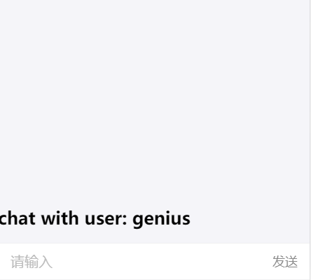
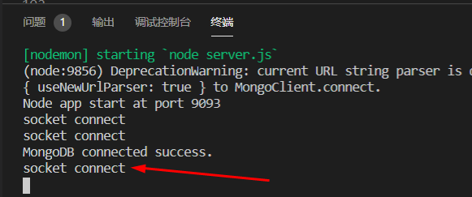
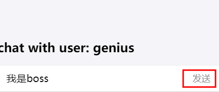
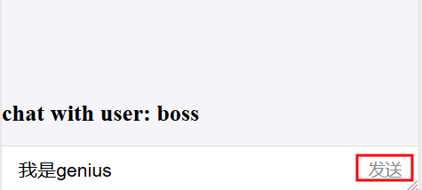
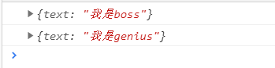

# 个人中心

# 目录
- [**一、Socket.io**](#一、Socket.io)
- [**二、前后端实时显示消息**](#二、前后端实时显示消息)
	- [2.1添加聊天路由界面](#2.1添加聊天路由界面)
	- [2.2socket前后端消息互通](#2.2socket前后端消息互通)

### <a id="一、Socket.io"></a>一、Socket.io

基于事件的实时双向通信库
- 基于websocket协议
- 前后端通过事件进行双向通信
- 配合express,快速开发实时应用

socket.io与ajax区别
- Ajax基于Http协议，单向，实时获取数据只能轮询
- socket.io基于websocket双向通信协议，后端可以主动推送数据
- 现代浏览器均支持websocket协议

### <a id="二、前后端实时显示消息"></a>二、前后端实时显示消息

- ### <a id="2.1添加聊天路由界面"></a>2.1添加聊天路由界面
src/index.js
```javascript
import Chat from "./component/chat";
	...
<Route path="/chat/:user" component={Chat} />
```

src/component/chat/index.js
```javascript
import React from "react";
import { List, InputItem } from "antd-mobile";

class Chat extends React.Component {
	constructor(props) {
		super(props);
		this.state = {
			text: ""
		};
	}
	handleSubmit() {
		console.log(this.state)
	}
	render() {
		return (
			<div className="stick-footer">
				<h2>chat with user: {this.props.match.params.user}</h2>
				<List>
					<InputItem
						placeholder="请输入"
						value={this.state.text}
						onChange={v => {
							this.setState({ text: v });
						}}
						extra={<span onClick={() => this.handleSubmit()}>发送</span>}></InputItem>
				</List>
			</div>
		);
	}
}
export default Chat;
```

列表添加跳转到聊天界面src/component/usercard/index.js
```javascript
...
import { withRouter } from "react-router-dom";

@withRouter
class UserCard extends React.Component {
	...
	handleClick(v) {
		this.props.history.push(`chat/${v.user}`);
	}
	render() {
		return (
			<WingBlank>
				{this.props.userlist.map((v, i) => {
					return v.avatar ? (
						<div key={i} onClick={() => this.handleClick(v)}>
							...
						</div>
					) : null;
				})}
			</WingBlank>
		);
	}
}

export default UserCard;
```
运行项目localhost:3000/login：boss登录，在牛人列表点击牛人genius进入与genius的聊天界面


- ### <a id="2.2socket前后端消息互通"></a>2.2socket前后端消息互通
安装依赖：
```javascript
npm install socket.io --save

npm install socket.io-client --save
```
后端：server/server.js
```javascript
const express = require("express");
const bodyParser = require("body-parser");
const cookieParser = require("cookie-parser");

const app = express();
// work width express
const server = require("http").Server(app);
const io = require("socket.io")(server);

io.on("connection", function(socket) {
	console.log("socket connect");
	// 接收sendmsg，获取到前端发送过来的数据
	socket.on("sendmsg", function(data) {
		// 发送全局recvmsg
		io.emit("recvmsg", data);
	});
});

const userRouter = require("./user");

app.use(cookieParser());
app.use(bodyParser.json());
app.use("/user", userRouter);

server.listen(9093, function() {
	console.log("Node app start at port 9093");
});
```

前端：src/component/chat/index.js
```javascript
import React from "react";
import { List, InputItem } from "antd-mobile";
import io from "socket.io-client";

const socket = io("ws://localhost:9093");

// 接收全局recvmsg
socket.on("recvmsg", function(data) {
	console.log(data);
});

class Chat extends React.Component {
	constructor(props) {
		super(props);
		this.state = {
			text: ""
		};
	}
	handleSubmit() {
		// 点击发送按钮：向后端发送sendmsg事件，将要发送的数据带过去
		socket.emit("sendmsg", { text: this.state.text });
		this.setState({ text: "" });
	}
	render() {
		return (
			<div className="stick-footer">
				<h2>chat with user: {this.props.match.params.user}</h2>
				<List>
					<InputItem
						placeholder="请输入"
						value={this.state.text}
						onChange={v => {
							this.setState({ text: v });
						}}
						extra={<span onClick={() => this.handleSubmit()}>发送</span>}></InputItem>
				</List>
			</div>
		);
	}
}

export default Chat;
```
准备两个浏览器，localhost:3000/login登录界面；<br>
boss登录：boss 123
genius登录：genius 123
在列表页找到互相的信息，点击进入聊天界面，进入聊天界面时，启动后端(node server/server.js或nodemon server/server.js)的终端上打印出信息即为socket连接成功。


两个聊天界面互相发送消息，前端发送sendmsg携带数据给后台，后台接收数据再发送全局recvmsg事件给前端接收，前端可以拿到两个人聊天的所有数据，形成聊天界面。

boss登录的与genius的聊天界面：http://localhost:3000/chat/genius<br>
genius登录的与boss的聊天界面：http://localhost:3000/chat/boss





<!-- 列表组件：[src/component/dashboard](https://github.com/ccyinghua/imooc-react-chat/blob/master/src/component/dashboard/index.js)

user个人中心路由组件：[src/component/user](https://github.com/ccyinghua/imooc-react-chat/blob/master/src/component/user/index.js)

登出清除redux：[src/redux/user.redux.js](https://github.com/ccyinghua/imooc-react-chat/blob/master/src/redux/user.redux.js) -->


