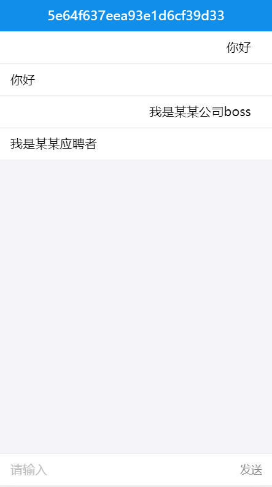
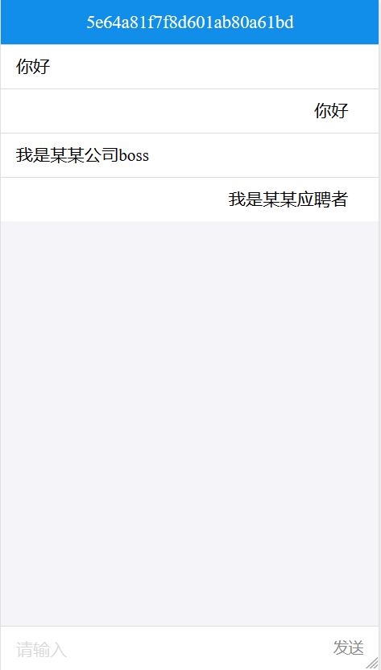
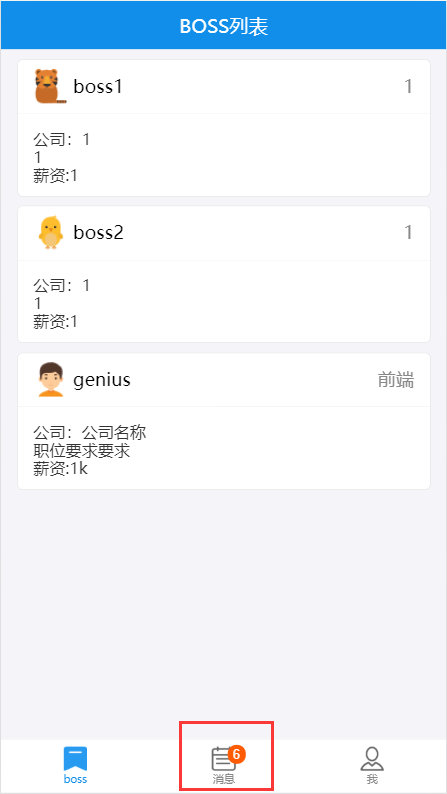
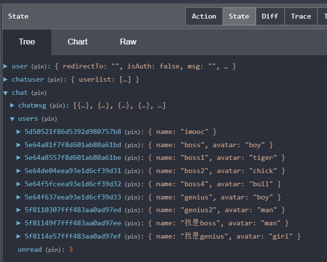
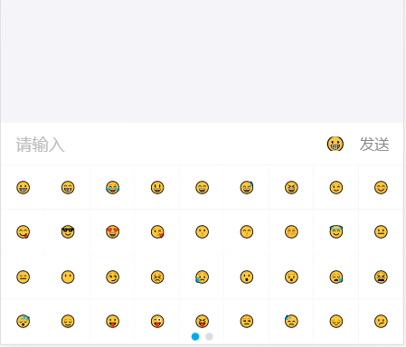

# 个人中心

# 目录
- [**一、Socket.io**](#一、Socket.io)
- [**二、前后端实时显示消息**](#二、前后端实时显示消息)
	- [2.1添加聊天路由界面](#2.1添加聊天路由界面)
	- [2.2socket前后端消息互通](#2.2socket前后端消息互通)
- [**三、聊天功能实现**](#三、聊天功能实现)
	- [3.1聊天功能](#3.1聊天功能)
	- [3.2未读消息数](#3.2未读消息数)
	- [3.3聊天头像名称与未读消息调整](#3.3聊天头像名称与未读消息调整)
	- [3.4发送emoji表情](#3.4发送emoji表情)


### <a id="一、Socket.io"></a>一、Socket.io

基于事件的实时双向通信库
- 基于websocket协议
- 前后端通过事件进行双向通信
- 配合express,快速开发实时应用

socket.io与ajax区别
- Ajax基于Http协议，单向，实时获取数据只能轮询
- socket.io基于websocket双向通信协议，后端可以主动推送数据
- 现代浏览器均支持websocket协议

### <a id="二、前后端实时显示消息"></a>二、前后端实时显示消息

- ### <a id="2.1添加聊天路由界面"></a>2.1添加聊天路由界面
src/index.js
```javascript
import Chat from "./component/chat";
	...
<Route path="/chat/:user" component={Chat} />
```

src/component/chat/index.js
```javascript
import React from "react";
import { List, InputItem } from "antd-mobile";

class Chat extends React.Component {
	constructor(props) {
		super(props);
		this.state = {
			text: ""
		};
	}
	handleSubmit() {
		console.log(this.state)
	}
	render() {
		return (
			<div className="stick-footer">
				<h2>chat with user: {this.props.match.params.user}</h2>
				<List>
					<InputItem
						placeholder="请输入"
						value={this.state.text}
						onChange={v => {
							this.setState({ text: v });
						}}
						extra={<span onClick={() => this.handleSubmit()}>发送</span>}></InputItem>
				</List>
			</div>
		);
	}
}
export default Chat;
```

列表添加跳转到聊天界面src/component/usercard/index.js
```javascript
...
import { withRouter } from "react-router-dom";

@withRouter
class UserCard extends React.Component {
	...
	handleClick(v) {
		this.props.history.push(`chat/${v.user}`);
	}
	render() {
		return (
			<WingBlank>
				{this.props.userlist.map((v, i) => {
					return v.avatar ? (
						<div key={i} onClick={() => this.handleClick(v)}>
							...
						</div>
					) : null;
				})}
			</WingBlank>
		);
	}
}

export default UserCard;
```
运行项目localhost:3000/login：boss登录，在牛人列表点击牛人genius进入与genius的聊天界面


- ### <a id="2.2socket前后端消息互通"></a>2.2socket前后端消息互通
安装依赖：
```javascript
// 后端
npm install socket.io --save

// 前端
npm install socket.io-client --save
```
后端：server/server.js
```javascript
const express = require("express");
const bodyParser = require("body-parser");
const cookieParser = require("cookie-parser");

const app = express();
// work width express
const server = require("http").Server(app);
const io = require("socket.io")(server);

io.on("connection", function(socket) {
	console.log("socket connect");
	// 接收sendmsg，获取到前端发送过来的数据
	socket.on("sendmsg", function(data) {
		// 发送全局recvmsg
		io.emit("recvmsg", data);
	});
});

const userRouter = require("./user");

app.use(cookieParser());
app.use(bodyParser.json());
app.use("/user", userRouter);

server.listen(9093, function() {
	console.log("Node app start at port 9093");
});
```

前端：src/component/chat/index.js
```javascript
import React from "react";
import { List, InputItem } from "antd-mobile";
import io from "socket.io-client";

const socket = io("ws://localhost:9093");

// 接收全局recvmsg
socket.on("recvmsg", function(data) {
	console.log(data);
});

class Chat extends React.Component {
	constructor(props) {
		super(props);
		this.state = {
			text: ""
		};
	}
	handleSubmit() {
		// 点击发送按钮：向后端发送sendmsg事件，将要发送的数据带过去
		socket.emit("sendmsg", { text: this.state.text });
		this.setState({ text: "" });
	}
	render() {
		return (
			<div className="stick-footer">
				<h2>chat with user: {this.props.match.params.user}</h2>
				<List>
					<InputItem
						placeholder="请输入"
						value={this.state.text}
						onChange={v => {
							this.setState({ text: v });
						}}
						extra={<span onClick={() => this.handleSubmit()}>发送</span>}></InputItem>
				</List>
			</div>
		);
	}
}

export default Chat;
```
准备两个浏览器，localhost:3000/login登录界面；<br>
boss登录：boss 123<br>
genius登录：genius 123<br>
在列表页找到互相的信息，点击进入聊天界面，进入聊天界面时，启动后端(node server/server.js或nodemon server/server.js)的终端上打印出信息即为socket连接成功。


两个聊天界面互相发送消息，前端发送sendmsg携带数据给后台，后台接收数据再发送全局recvmsg事件给前端接收，前端可以拿到两个人聊天的所有数据，形成聊天界面。

boss登录的与genius的聊天界面：http://localhost:3000/chat/genius<br>
genius登录的与boss的聊天界面：http://localhost:3000/chat/boss<br>
<br>
<br>


### <a id="三、聊天功能实现"></a>三、聊天功能实现

### <a id="3.1聊天功能"></a>3.1聊天功能

- #### 后端

[server/model.js](https://github.com/ccyinghua/imooc-react-chat/blob/master/server/model.js) 添加mongodb聊天模型
```javascript
const models = {
	// 聊天模型
	chat: {
		chatid: { type: String, require: true },
		from: { type: String, require: true }, // 发消息的用户id
		to: { type: String, require: true }, // 接消息的用户id
		read: { type: Boolean, default: false }, // 已读未读
		content: { type: String, require: true, default: "" },
		create_time: { type: Number, default: new Date().getTime() }
	}
};
```
[server/server.js](https://github.com/ccyinghua/imooc-react-chat/blob/master/server/server.js) 前后端消息连接
```javascript
const express = require("express");
const model = require("./model");
const Chat = model.getModel("chat");

const app = express();
// work width express
const server = require("http").Server(app);
const io = require("socket.io")(server);

io.on("connection", function(socket) {
	console.log("socket connect");
	// 接收sendmsg，获取到前端发送过来的数据
	socket.on("sendmsg", function(data) {
		const { from, to, msg } = data;
		const chatid = [from, to].sort().join("_");
		Chat.create({ chatid, from, to, content: msg }, function(err, doc) {
			// 发送全局recvmsg,告诉要接受信息了
			io.emit("recvmsg", Object.assign({}, doc._doc));
		});
	});
});
```
[server/user.js](https://github.com/ccyinghua/imooc-react-chat/blob/master/server/user.js) 获取消息列表接口
```javascript
const model = require("./model");
const Chat = model.getModel("chat");

// 获取聊天列表
Router.get("/getmsglist", function(req, res) {
	const users = req.cookies.user;
	// {"$or":[{form: user, to: user}]}
	Chat.find({}, function(err, doc) {
		if (!err) {
			return res.json({ code: 0, msgs: doc });
		}
	});
});
```

- #### 前端

建立聊天数据redux：[src/redux/chat.redux.js](https://github.com/ccyinghua/imooc-react-chat/blob/master/src/redux/chat.redux.js)
```javascript
import axios from "axios";
import io from "socket.io-client";

const socket = io("ws://localhost:9093");

// 获取聊天列表
const MSG_LIST = "MSG_LIST";
// 读取信息
const MSG_RECV = "MSG_RECV";
// 标识已读
const MSG_READ = "MSG_READ";

const initState = {
	chatmsg: [],
	unread: 0 // 未读消息的数量
};

// reducer处理函数
export function chat(state = initState, action) {
	switch (action.type) {
		case MSG_LIST:
			return { ...state, chatmsg: action.payload, unread: action.payload.filter(v => !v.read).length };
		case MSG_RECV:
			return { ...state, chatmsg: [...state.chatmsg, action.payload], unread: state.unread + 1 };
		case MSG_READ:
			return { ...state, isAuth: false, msg: action.msg };
		default:
			return state;
	}
}

function msgList(msgs) {
	return { type: MSG_LIST, payload: msgs };
}

function msgRecv(msg) {
	return { type: MSG_RECV, payload: msg };
}

// 获取消息列表
export function getMegList(userinfo) {
	return dispatch => {
		axios.get("/user/getmsglist").then(res => {
			if (res.status === 200 && res.data.code === 0) {
				dispatch(msgList(res.data.msgs));
			}
		});
	};
}

// 发送信息
export function sendMsg({ from, to, msg }) {
	return dispatch => {
		// console.log({ from, to, msg });
		socket.emit("sendmsg", { from, to, msg });
	};
}

// 接收信息
export function recvMsg() {
	return dispatch => {
		// 接收全局recvmsg
		socket.on("recvmsg", data => {
			// console.log("recvmsg", data);
			dispatch(msgRecv(data));
		});
	};
}
```
[src/reducer.js](https://github.com/ccyinghua/imooc-react-chat/blob/master/src/reducer.js)
```javascript
// 合并所有reducer 并且返回
import { combineReducers } from "redux";
import { user } from "./redux/user.redux";
import { chatuser } from "./redux/chatuser.redux";
import { chat } from "./redux/chat.redux";

export default combineReducers({ user, chatuser, chat });
```
人员列表点击添加跳转到聊天界面，携带聊天对象id: [src/component/usercard](https://github.com/ccyinghua/imooc-react-chat/blob/master/src/component/usercard/index.js)
```javascript
import { withRouter } from "react-router-dom";

@withRouter
class UserCard extends React.Component {
	handleClick(v) {
		// v._id用户在mongoDB的唯一标识
		this.props.history.push(`chat/${v._id}`);
	}
	......
}
```
聊天界面发送聊天消息与渲染聊天内容：[src/component/chat](https://github.com/ccyinghua/imooc-react-chat/blob/master/src/component/chat/index.js)
```javascript
import React from "react";
import { List, InputItem, NavBar } from "antd-mobile";
import { connect } from "react-redux";
import { getMegList, sendMsg, recvMsg } from "../../redux/chat.redux";
// import io from "socket.io-client";
// const socket = io("ws://localhost:9093");

@connect(
	state => state,
	{ getMegList, sendMsg, recvMsg }
)
class Chat extends React.Component {
	constructor(props) {
		super(props);
		this.state = {
			text: ""
		};
	}
	componentDidMount() {
		// 接收全局recvmsg
		// socket.on("recvmsg", data => {
		// 	console.log(data);
		// });
		this.props.getMegList();
		this.props.recvMsg();
	}
	handleSubmit() {
		// 点击发送按钮：向后端发送sendmsg事件，将要发送的数据带过去
		// socket.emit("sendmsg", { text: this.state.text });
		// this.setState({ text: "" });

		const from = this.props.user._id; // 发送人id
		const to = this.props.match.params.user; // 接收人id(从路由上拿)
		const msg = this.state.text;
		this.props.sendMsg({ from, to, msg });
		this.setState({ text: "" });
	}
	render() {
		const user = this.props.match.params.user;
		return (
			<div id="chat-page">
				<NavBar mode="dark">{this.props.match.params.user}</NavBar>
				{this.props.chat.chatmsg.map(v => {
					return v.from === user ? (
						<List key={v._id}>
							<List.Item>{v.content}</List.Item>
						</List>
					) : (
						<List key={v._id}>
							<List.Item extra={""} className="chat-me">
								{v.content}
							</List.Item>
						</List>
					);
				})}
				<div className="stick-footer">
					<List>
						<InputItem
							placeholder="请输入"
							value={this.state.text}
							onChange={v => {
								this.setState({ text: v });
							}}
							extra={<span onClick={() => this.handleSubmit()}>发送</span>}
						></InputItem>
					</List>
				</div>
			</div>
		);
	}
}

export default Chat;
```
两个浏览器，localhost:3000/login登录界面；<br>
boss登录：boss 123<br>
genius登录：genius 123<br>
点击进入互相聊天界面<br>
boss登录的聊天界面：<br>
<br>
genius登录的聊天界面：<br>


### <a id="3.2未读消息数"></a>3.2未读消息数
本来是在聊天页面`src/component/chat`实时获取消息列表与接收消息的，现需要在dashboard首页显示未读消息数，在首页[src/component/dashboard](https://github.com/ccyinghua/imooc-react-chat/blob/master/src/component/dashboard/index.js)也添加获取消息与接收

聊天页面src/component/chat
```javascript
class Chat extends React.Component {
	......
	componentDidMount() {
		// 添加判断，在页面刷新时获取，从首页进入时，首页已经获取消息了。
		if (!this.props.chat.chatmsg.length) {
			this.props.getMegList();
			this.props.recvMsg();
		}
	}
	......
}
```

首页[src/component/dashboard](https://github.com/ccyinghua/imooc-react-chat/blob/master/src/component/dashboard/index.js)
```javascript
import { getMegList, recvMsg } from "../../redux/chat.redux";

@connect(
	state => state,
	{ getMegList, recvMsg }
)
class Dashboard extends React.Component {
	componentDidMount() {
		// 添加判断，防止来回切换重复获取消息
		if (!this.props.chat.chatmsg.length) {
			this.props.getMegList();
			this.props.recvMsg();
		}
	}
	......
}
```

首页底部的tabBar组件[src/component/navLink](https://github.com/ccyinghua/imooc-react-chat/blob/master/src/component/navLink/index.js)
```javascript
import { connect } from "react-redux";

@connect(state => state.chat)
class NavLinkBar extends React.Component {
	...
	render() {
		return (
			<TabBar>
				{navList.map(v => {
					return (
						<TabBar.Item 
							badge={v.path === "/msg" ? this.props.unread : 0}
							...
						></TabBar.Item>
					);
				})}
			</TabBar>
		);
	}
}
```
两个浏览器，localhost:3000/login登录界面；<br>
boss登录：boss 123<br>
genius登录：genius 123<br>
genius登录的进入与boss的聊天界面，发送消息<br>
boss登录的首页：<br>
<br>


### <a id="3.3聊天头像名称与未读消息调整"></a>3.3聊天头像名称与未读消息调整

后端调整[server/user.js](https://github.com/ccyinghua/imooc-react-chat/blob/master/server/user.js)，聊天列表返回所有的关于登录人的消息，还有所有用户的头像与名称。
```javascript
// 获取聊天列表
Router.get("/getmsglist", function(req, res) {
	// const user = req.cookies.user;
	const user = req.cookies.userid;

	User.find({}, function(e, userdoc) {
		let users = {};
		userdoc.forEach(v => {
			users[v._id] = { name: v.user, avatar: v.avatar };
		});

		Chat.find({ $or: [{ from: user }, { to: user }] }, function(err, doc) {
			if (!err) {
				return res.json({ code: 0, msgs: doc, users: users });
			}
		});
	});

	// Chat.find({}, function(err, doc) {
	// 	if (!err) {
	// 		return res.json({ code: 0, msgs: doc });
	// 	}
	// });
});
```
前端:聊天redux添加users，储存所有用户头像与姓名[src/redux/chat.redux.js](https://github.com/ccyinghua/imooc-react-chat/blob/master/src/redux/chat.redux.js)，修正消息未读个数`unread`，只有发送给登录人的消息才是未读的，发出去的不在范围内。

```javascript
import axios from "axios";
import io from "socket.io-client";

const socket = io("ws://localhost:9093");

// 获取聊天列表
const MSG_LIST = "MSG_LIST";
// 读取信息
const MSG_RECV = "MSG_RECV";
// 标识已读
const MSG_READ = "MSG_READ";

const initState = {
	chatmsg: [],
	users: {},
	unread: 0 // 未读消息的数量
};

// reducer处理函数
export function chat(state = initState, action) {
	switch (action.type) {
		case MSG_LIST:
			return { ...state, users: action.payload.users, chatmsg: action.payload.msgs, unread: action.payload.msgs.filter(v => !v.read && v.to == action.payload.userid).length };
		case MSG_RECV:
			const n = action.payload.to === action.userid ? 1 : 0;
			return { ...state, chatmsg: [...state.chatmsg, action.payload], unread: state.unread + n };
		case MSG_READ:
			return { ...state, isAuth: false, msg: action.msg };
		default:
			return state;
	}
}

function msgList(msgs, users, userid) {
	return { type: MSG_LIST, payload: { msgs, users, userid } };
}

function msgRecv(msg, userid) {
	return { type: MSG_RECV, payload: msg, userid };
}

// 获取消息列表
export function getMegList(userinfo) {
	return (dispatch, getState) => {
		axios.get("/user/getmsglist").then(res => {
			if (res.status === 200 && res.data.code === 0) {
				const userid = getState().user._id;
				dispatch(msgList(res.data.msgs, res.data.users, userid));
			}
		});
	};
}

// 发送信息
export function sendMsg({ from, to, msg }) {
	return dispatch => {
		// console.log({ from, to, msg });
		socket.emit("sendmsg", { from, to, msg });
	};
}

// 接收信息
export function recvMsg() {
	return (dispatch, getState) => {
		// 接收全局recvmsg
		socket.on("recvmsg", data => {
			// console.log("recvmsg", data);
			const userid = getState().user._id;
			dispatch(msgRecv(data, userid));
		});
	};
}
```
<br>

[src/util.js](https://github.com/ccyinghua/imooc-react-chat/blob/master/src/util.js)
```javascript
/**
 * 获取chatid
 * @param {*} userId 聊天对象的id
 * @param {*} targetId 本人即登录人的id
 */
export function getChatId(userId, targetId) {
	return [userId, targetId].sort().join("_");
}
```
聊天界面修改[src/component/chat](https://github.com/ccyinghua/imooc-react-chat/blob/master/src/component/chat/index.js)，添加头像与名称，并对消息列表进行过滤，只筛选出登录人与当前聊天人的消息。
```javascript
render() {
	const userid = this.props.match.params.user;

	const users = this.props.chat.users || {};

	if (!users[userid]) {
		return null;
	}

	const chatid = getChatId(userid, this.props.user._id);
	// this.props.chat.chatmsg是所有的消息列表
	const chatmsgs = this.props.chat.chatmsg.filter(v => v.chatid === chatid);

	return (
		<div id="chat-page">
			<NavBar
				mode="dark"
				icon={<Icon type="left" />}
				onLeftClick={() => {
					this.props.history.goBack();
				}}>
				{users[userid].name}
			</NavBar>
			{chatmsgs.map(v => {
				const avatar = require(`../assets/img/${users[v.from].avatar}.png`);
				return v.from === userid ? (
					<List key={v._id}>
						<List.Item thumb={avatar}>{v.content}</List.Item>
					</List>
				) : (
						<List key={v._id}>
							<List.Item extra={} className="chat-me">
								{v.content}
							</List.Item>
						</List>
					);
			})}
			......
		</div>
	);
}
```

### <a id="3.4发送emoji表情"></a>3.4发送emoji表情

聊天界面[src/component/chat](https://github.com/ccyinghua/imooc-react-chat/blob/master/src/component/chat/index.js)

```javascript
import React from "react";
import { List, InputItem, NavBar, Icon, Grid } from "antd-mobile";
import { connect } from "react-redux";
import { getMegList, sendMsg, recvMsg } from "../../redux/chat.redux";
import { getChatId } from "../../util";
// import io from "socket.io-client";
// const socket = io("ws://localhost:9093");

@connect(
	state => state,
	{ getMegList, sendMsg, recvMsg }
)
class Chat extends React.Component {
	constructor(props) {
		super(props);
		this.state = {
			text: "",
			showEmoji: false
		};
	}
	
	fixCarousel() {
		setTimeout(() => {
			window.dispatchEvent(new Event("resize"));
		}, 0);
	}
	handleSubmit() {
		......
		this.setState({ text: "", showEmoji: false });
	}
	render() {
		const emoji = "😀 😁 😂 😃 😄 😅 😆 😉 😊 😋 😎 😍 😘 😗 😙 😚 😇 😐 😑 😶 😏 😣 😥 😮 😯 😪 😫 😴 😌 😛 😜 😝 😒 😓 😔 😕 😲 😷 😖 😞 😟 😤 😢 😭 😦 😧 😨 😬 😰 😱 😳 😵 😡 😠"
			.split(" ")
			.filter(v => v)
			.map(v => ({ text: v }));
		......

		return (
			<div id="chat-page">
				......
				<div className="stick-footer">
					<List>
						<InputItem
							placeholder="请输入"
							value={this.state.text}
							onChange={v => {
								this.setState({ text: v });
							}}
							extra={
								<div>
									{/* eslint-disable */}
									<span
										style={{ marginRight: 15 }}
										onClick={() => {
											this.setState({ showEmoji: !this.state.showEmoji });
											this.fixCarousel();
										}}
									>
										😀
									</span>
									<span onClick={() => this.handleSubmit()}>发送</span>
								</div>
							}
						></InputItem>
					</List>

					{this.state.showEmoji ? (
						<Grid
							data={emoji}
							columnNum={9}
							carouselMaxRow={4}
							isCarousel={true}
							onClick={el => {
								this.setState({
									text: this.state.text + el.text
								});
							}}
						/>
					) : null}
				</div>
			</div>
		);
	}
}

export default Chat;
```



