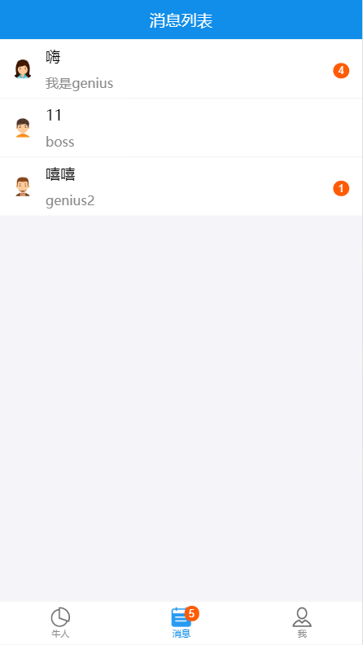
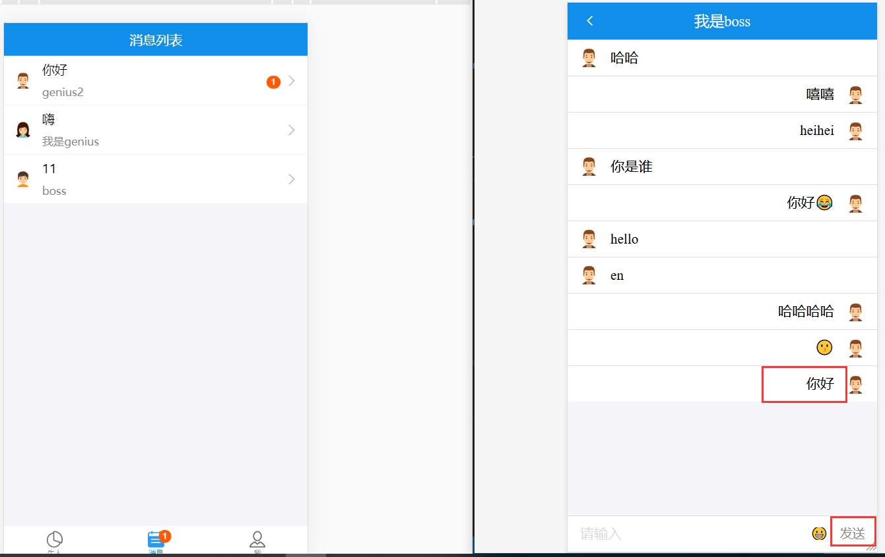
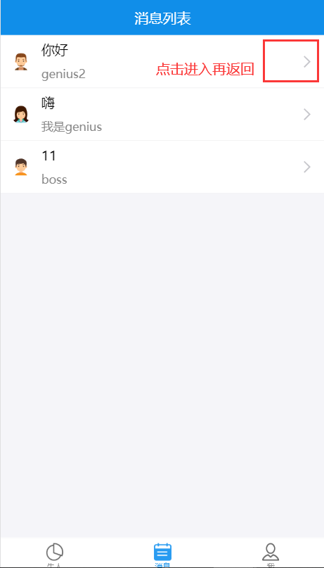

# 聊天列表

# 目录
- [**一、聊天列表**](#一、聊天列表)
- [**二、消息未读数更新**](#二、消息未读数更新)


### <a id="一、聊天列表"></a>一、聊天列表
首页引入消息列表Msg组件：[src/component/dashboard](https://github.com/ccyinghua/imooc-react-chat/blob/master/src/component/dashboard/index.js)<br>

添加消息列表页面：[src/component/msg](https://github.com/ccyinghua/imooc-react-chat/blob/master/src/component/msg/index.js)
```javascript
import React from "react";
import { List, Badge } from "antd-mobile";
import { connect } from "react-redux";

@connect(state => state)
class Msg extends React.Component {
	constructor(props) {
		super(props);
		this.state = {};
	}

	getLast(arr) {
		return arr[arr.length - 1];
	}

	render() {
		// 当前登录的id
		const userid = this.props.user._id;
		const userInfo = this.props.chat.users;

		// 按照聊天用户分组，根据chatid
		// msgGroup={chatid值: 消息数组}
		const msgGroup = {};
		this.props.chat.chatmsg.forEach(v => {
			msgGroup[v.chatid] = msgGroup[v.chatid] || [];
			msgGroup[v.chatid].push(v);
		});

		// 最新的聊天消息要放在最前面
		const chatList = Object.values(msgGroup).sort((a, b) => {
			const a_last = this.getLast(a).create_time;
			const b_last = this.getLast(b).create_time;
			return b_last - a_last;
		});

		return (
			<div id="chat-page">
				{chatList.map(v => {
					const lastItem = this.getLast(v); // 最新一条消息数据
					const targetId = v[0].from === userid ? v[0].to : v[0].from; // 聊天对象id
					const unreadNum = v.filter(v => !v.read && v.to === userid).length; // 未读数量
					return (
						<List key={lastItem._id}>
							<List.Item
								extra={<Badge text={unreadNum}></Badge>}
								thumb={userInfo[targetId] && require(`../assets/img/${userInfo[targetId].avatar}.png`)}
								arrow="horizontal"
								onClick={() => {
									this.props.history.push(`/chat/${targetId}`)
								}}
							>
								{lastItem.content}
								<List.Item.Brief>{userInfo[targetId] ? userInfo[targetId].name : ""}</List.Item.Brief>
							</List.Item>
						</List>
					);
				})}
			</div>
		);
	}
}

export default Msg;
```


### <a id="二、消息未读数更新"></a>二、消息未读数更新
当在聊天界面返回列表时，与当前聊天对象的消息都应该标识成已读。

- #### 后端
[server/user.js](https://github.com/ccyinghua/imooc-react-chat/blob/master/server/user.js)添加已读接口
```javascript
Router.post('/readmsg', function (req, res) {
	const { userid } = req.cookies;
	const { from } = req.body;

	Chat.update(
		{ from, to: userid },
		{ '$set': { read: true } },
		{ 'multi': true },
		function (err, doc) {
			// doc: {n: 1, nModified: 0, ok: 1} n-消息数,nModified-修改了几条,ok修改是否成功
			if (!err) {
				return res.json({ code: 0, num: doc.nModified });
			}
			return res.json({ code: 1, msg: "修改失败" });
		});
})
```
- #### 前端
聊天界面[src/component/chat](https://github.com/ccyinghua/imooc-react-chat/blob/master/src/component/chat/index.js)
```javascript
import { getMegList, sendMsg, recvMsg, readMsg } from "../../redux/chat.redux";

@connect(
	state => state,
	{ getMegList, sendMsg, recvMsg, readMsg }
)
class Chat extends React.Component {
	......
	componentWillUnmount() {
		const to = this.props.match.params.user; // 聊天对象id
		this.props.readMsg(to)
	}
	......
}

export default Chat;
```

chat聊天redux: [src/redux/chat.redux.js](https://github.com/ccyinghua/imooc-react-chat/blob/master/src/redux/chat.redux.js)
```javascript
import axios from "axios";
import io from "socket.io-client";

const socket = io("ws://localhost:9093");

// 获取聊天列表
const MSG_LIST = "MSG_LIST";
// 读取信息
const MSG_RECV = "MSG_RECV";
// 标识已读
const MSG_READ = "MSG_READ";

const initState = {
	chatmsg: [],
	users: {},
	unread: 0 // 未读消息的数量
};

// reducer处理函数
export function chat(state = initState, action) {
	switch (action.type) {
		......
		case MSG_READ:
			return {
				...state, chatmsg: state.chatmsg.map(v => ({ ...v, read: v.from === action.payload.from ? true : v.read })), unread: state.unread - action.payload.num
			};
		default:
			return state;
	}
}

function msgRead({ from, userid, num }) {
	return { type: MSG_READ, payload: { from, userid, num } }
}

// 标识已读消息
export function readMsg(from) {
	return (dispatch, getState) => {
		axios.post('/user/readmsg', { from }).then(res => {
			const userid = getState().user._id;
			if (res.status === 200 && res.data.code === 0) {
				const userid = getState().user._id;
				dispatch(msgRead({ userid, from, num: res.data.num }));
			}
		})
	}
}
```
两个浏览器，localhost:3000/login登录界面；<br>
boss登录：我是boss 123<br>
genius登录：genius2 123<br>
<br>
<br>
