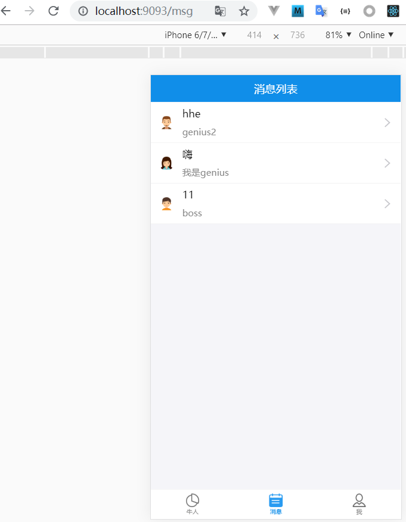

# 打包编译

# 目录
- [**一、打包编译**](#一、打包编译)

### <a id="一、打包编译"></a>一、打包编译
- 编译打包后，生成build目录
- express中间件，拦截路由，手动渲染index.html
- build设置为静态资源地址

打包项目
```javascript
yarn build
```

后端配置文件[server/server.js](https://github.com/ccyinghua/imooc-react-chat/blob/master/server/server.js)
```javascript
const path = require("path");


/**
 * 项目部署：
 * 1、购买域名
 * 2、DNS解析到你的服务器的IP
 * 3、安装nginx
 * 4、使用pm2管理node进程
 */
app.use(function (req, res, next) {
	if (req.url.startsWith('/user/') || req.url.startsWith('/static/')) {
		return next();
	}
	return res.sendFile(path.resolve('build/index.html'))
})
app.use('/', express.static(path.resolve('build')))
```

命令node server/server.js 或者 nodemon server/server.js，或者在package.json添加一个命令`"server": "nodemon server/server.js"`再执行`npm run server或yarn server`

浏览器使用后端服务端端口访问页面，访问成功打包编译完成<br>
http://localhost:9093/login 登录界面<br>
http://localhost:9093/msg 消息列表页面<br>
<br>